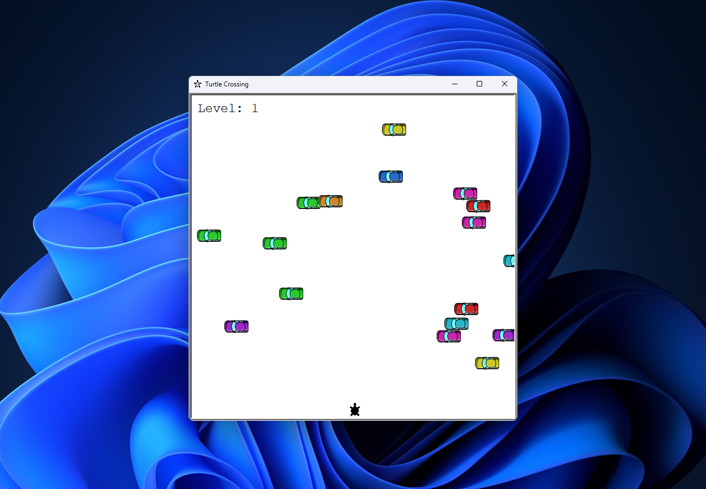

# Turtle Crossing Game

  

## Overview

The Turtle Crossing Game is a fun and interactive game built using Python with the tkinter GUI library and the Turtle graphics module. It provides an engaging experience where players help a turtle cross a busy road while avoiding oncoming obstacles.

## Features

- Intuitive controls using arrow keys.
- Keep track of your level as you successfully navigate the turtle across the road.
- Colorful graphics and animations for an immersive gameplay experience.

## Requirements

- Windows OS

## Installation

1. Go to the Releases section of this repository.
2. Download the latest release (`turtle_crossing_game_v0.1.0.zip`).
3. Extract the downloaded ZIP file to a location of your choice.
4. Double-click on `turtle_crossing_game.exe` to start playing the game.

## Gameplay

- Use the arrow keys to control the turtle's movement.
- Help the turtle cross the road safely, avoiding oncoming cars.
- Each successful crossing levels you up to the next stage where cars are much faster than before.
- The game ends when the turtle collides with a car.

## Screenshots

## Configuration

You can customize the following parameters in `turtle_crossing_game.py`:

- `STARTING_MOVE_DISTANCE` in `car_manager.py`: Adjust the speed of oncoming cars.
- `MOVE_DISTANCE`in `player.py`: Set the turtle's movement speed.
- `MOVE_INCREMENT`: Define the increment of oncoming cars' speed on each level.

## Contributing

If you'd like to contribute, please fork the repository and create a pull request. Please make sure to update tests as appropriate.

## Support

If you encounter any issues or have suggestions, please [open an issue](https://github.com/yourusername/turtle-crossing-game/issues).

## Roadmap

- [ ] Add additional levels or challenges.
- [ ] Implement a leaderboard feature.
- [ ] Create additional themes for the game.

## Authors

- [Muhzin Khan](https://github.com/muhzinkhan)

